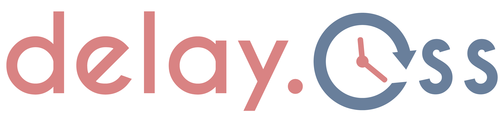

# delay.css [](https://travis-ci.org/khaosdoctor/delay.css)

> CSS animation timming helpers

## Stats

First, some stats!

### Info

[](https://raw.githubusercontent.com/khaosdoctor/ngs/master/LICENSE)
[](https://github.com/khaosdoctor/ngs/issues)

### Code Status

[](https://david-dm.org/khaosdoctor/delay.css?type=dev)

### Build Status

Branch Master: [](https://travis-ci.org/khaosdoctor/delay.css)

Branch dev: [](https://travis-ci.org/khaosdoctor/delay.css)

## Whats is it

Delay.css works best along with [Daniel Eden's](https://github.com/daneden) [Animate.css](https://github.com/daneden/animate.css), by including CSS classes and helpers to control animation timmings and delays, but it works on any kind of CSS animations as well.

In other words, it is possible to add sequential animations or increase the duration of a particular animation using only a tiny helper class.

> But we can also do this with CSS3, why add this?

Because of the same reason we have [Animate.css](https://github.com/daneden/animate.css), it is just easier to implement something that has already been done and tested than create something from scratch.

### TL;DR

Delay.css was created to help you control your CSS animation timmings within a project.

## Installing

```
$ bower install delay.css --save
```

It also works with npm:

```
$ npm i delay.css --save
```

## Using

First of all, add the css to your document's head:

```html
<head>
  <link rel="stylesheet" href="delay.css">
</head>
```

Then select the desired duration or delay.

Delay.css is divided into 100ms blocks that goes from 100 to 6000 (100ms to 6s) of timming control, and two simple classes `.delay-<ms>` and `.duration-<ms>`.

This can be easily adjusted if you need less or more timming control (as you will see in the next section). Each class will delay the start of the animation by the amount of miliseconds it describes. So the class `.delay-100` will delay the start of the start of the animation by 100ms and `.duration-100` will __force__ the animation to have 100ms long.

This can be easily adjusted if you need less or more timming control (as you will see in the next section).

To use it, just add the corresponding classes to your elements, for instance:

```html
<div class="animate fadeInDown delay-1200"> <!-- This will happen first -->
  <h1 class="animate fadeInUp delay-1500">This is a header</h1> <!-- This will happen 300ms after the div has appeared -->
</div>
```

Try it out in your css, or [see it in action](https://khaosdoctor.github.io/delay.css).

### Custom builds

To add or remove timmings from your customized version of this project, just go to the `src` folder and modify the file called `delay.scss`.

There will be 3 Sass variables, `$i` (which stands for `increment`, do __not__ touch this!), `$maxms` which will be the max time your delay/duration will have and `$hops` which, of course, will be the size of the "jumps" between values.

Example:

```scss
$i: 0;
$maxms: 7500;
$hops: 500;
```

Will generate a file containing `.delay-` and `.duration-` classes that goes from 500 to 7500ms jumping in ranges of 500ms each.

- .delay-500
- .delay-1000
- .delay-1500
- ...

As this uses Sass, you'll need to build it using your own sass compiler or running the gulpfile included in the project when you download it, just type `npm i` (if you didn't install the dependencies) then `gulp` and it will create a `dist` folder with your alterations.

## Wanna join the team?

Yeah! I'm always looking to find someone eager to contribute to this humble project! So, if you didn't yet, please read the [guidelines](CONTRIBUTING.md) before sending anything, this way we can discuss things more easily.

Also, all the contributors here must agree to the [Contributor Covenant](http://contributor-covenant.org/) code of conduct.

Once you are confortable, commit away! I promisse to read it ok?

## License

MPL 2.0 © [Lucas Santos](https://github.com/khaosdoctor)
